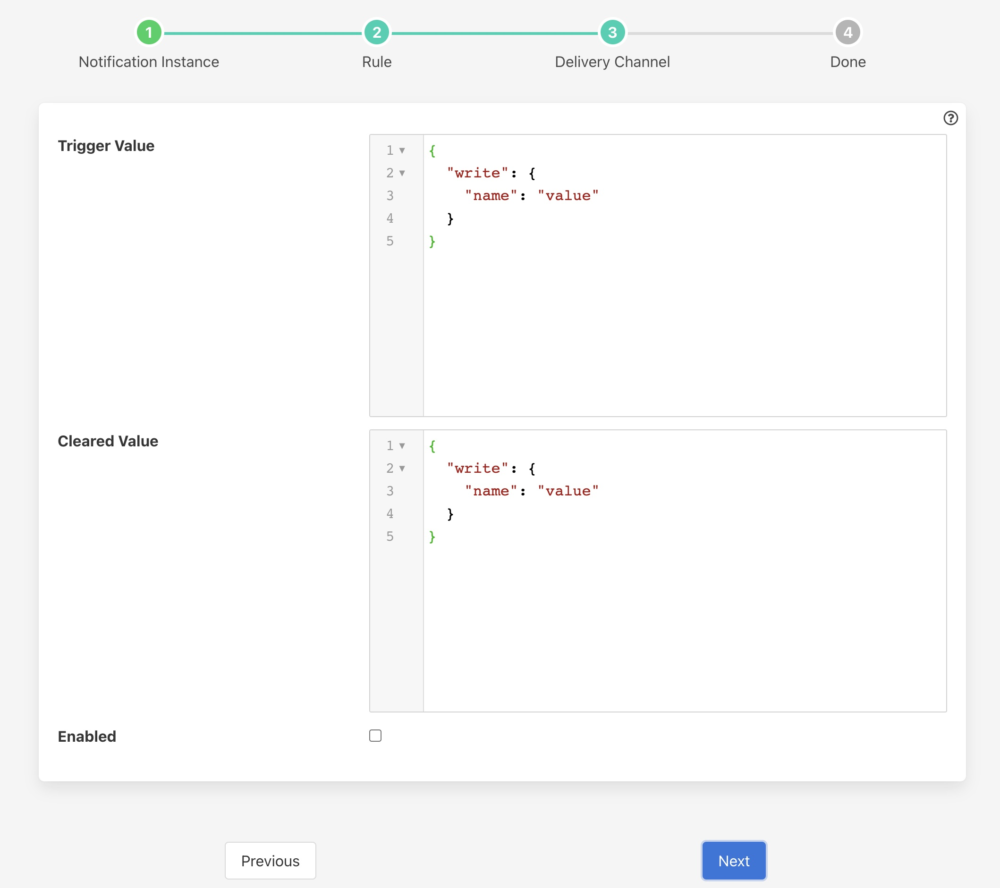

.. Images

.. |scripts| raw:: html

    <a href="../control.html#automation-scripts">Automation Scripts</a>

Control Dispatcher Notification
===============================

The *fledge-notify-control* notification delivery plugin is a mechanism by which a notification can be used to send set point control writes and operations via the control dispatcher service.

Once you have created your notification rule and move on to the delivery mechanism

  - Select the control plugin from the list of plugins

  - Click *Next*

    +-------------+
    | |control_1| |
    +-------------+

  - Configure the plugin

    - **Trigger Value**: The control payload to send to the dispatcher service. These are set when the notification rule triggers.

    - **Cleared Value**: The control payload to send to the dispatcher service. There are set when the notification rule clears.

  - Enable the plugin and click *Next*

  - Complete your notification setup

Trigger Values
--------------

The *Trigger Value* and *Cleared Value* are JSON documents that are sent to the dispatcher. The format of these is a JSON document that describes the control operation to perform.

The document also contains a definition of the recipient of the control input, this may be a south service, an asset, an automation script or all south services.

If the recipient is a service then the document contains a *service* key, the value of which is the name of the south service that should receive the control operation.

To send the control request to the south service responsible for the ingest of a particular asset, then an *asset* key would be given.

If sending to an automation script then a *script* key would be given.

If none of the *service*, *asset* or *script* keys are given then the request will be sent to all south services that support control.

The document also contains the control request that should be made, either a *write* or an *operation* and the values to write or the name and parameters of the operation to perform.

Examples
~~~~~~~~

The example below shows a JSON document that would cause the two values *temperature* and *rate* to be written to the south service called *oven001*.

.. code-block:: JSON

   {
       "service" : "oven001",
       "write": {
          "temperature" : "110",
          "rate"        : "245"
       }
   }

In this example the values are constants defined in the plugin configuration. It is possible however to use values that are in the data that triggered the notification.

As an example of this assume we are controlling the speed of a fan based on the temperature of an item of equipment. We have a south service that is reading the temperature of the equipment, let's assume this is in an asset called *equipment* which has a data point called *temperature*. We add a filter using the *fledge-filter-expression* filter to calculate a desired fan speed. The expression we will use in this example is *desiredSpeed = temperature * 100*. This will case the asset to have a second data point called *desiredSpeed*.

We create a notification that is triggered if the *desiredSpeed* is greater than 0. The delivery mechanism will be this plugin, *fledge-notify-setpoint*. We want to set two values in the south plugin *speed* to set the speed of the fan and *run* which controls if the fan is on or off. We set the *Trigger Value* to the following

.. code-block:: JSON

   {
       "service" : "fan001",
       "write": {
            "speed" : "$equipment.desiredSpeed$",
            "run"   : "1"
       }
    }

In this case the *speed* value will be substituted by the value of the *desiredSpeed* data point of the *equipment* asset that triggered the notification to be sent.

Asset Based Control
###################

If the fan is controlled by the same south service that is ingesting the data into the asset *equipment*, then we could use the *asset* destination key rather than name the south service explicitly. This is useful because it allows us to write control paths that related to physical assets rather than the services in Fledge that are monitoring the assets.

.. code-block:: JSON

   {
       "asset" : "equipment",
       "write": {
            "speed" : "$equipment.desiredSpeed$",
            "run"   : "1"
       }
    }

Script Based Control
####################

It is also possible to deliver a control request to a control script. To do this we use the *script* destination in the definition of the trigger action.

.. code-block:: JSON

   {
       "script" : "setSpeed",
       "write": {
            "speed" : "$equipment.desiredSpeed$"
       }
    }

The above trigger definition will call the script *setSpeed* with the parameter *speed*. You will note in this case we have only given a single parameter, it is possible to have multiple parameters but in the example we have assumed the script will deal with the fixed action of writing *1* to the *run* set point of the destination.

Scripts offer a much richer set of actions than a single write as they allow for sending requests to multiple destinations, having conditional steps in the script, inducing delays between operations. Scripts are more fully described in the section on |scripts|.

Broadcast Control
#################

Another option for controlling the destination of a control request is to broadcast it to all south services. In this example we will assume we want to trigger a shutdown operation across all the devices we monitor.

.. code-block:: JSON

    {
        "operation" : {
            "shutdown" : { }
        }
    }

Here we are not giving *asset*, *script* or *service* keys, therefore the control request will be broadcast. Also we have used an *operation* rather than a *write* request. The operation name is *shutdown* and we have assumed it takes no arguments.

Broadcasting control operations like this is useful if we want to control a set of assets in a single request. Any south service that receives the request and does not implement the operation, has control disabled or does not support the write operation on the key given will simply ignore the request.
